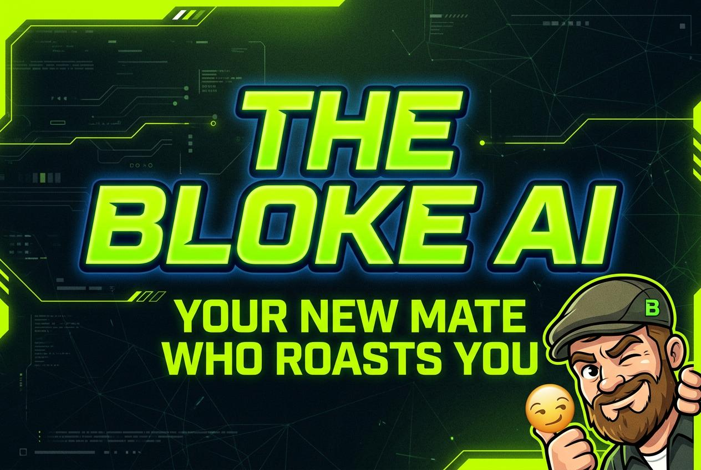

<p align="center">
  
</p>

<p align="center">
  <strong>Your new mate who roasts you.</strong><br/>
  A sarcastic, culturally-aware AI companion web app.
</p>

<p align="center">
  <a href="#features">Features</a> &bull;
  <a href="#tech-stack">Tech Stack</a> &bull;
  <a href="#getting-started">Getting Started</a> &bull;
  <a href="#project-structure">Project Structure</a> &bull;
  <a href="#screenshots">Screenshots</a>
</p>

---

## About

**The Bloke AI** is a mobile-first AI companion that acts like that cheeky older brother or the loud, funny guy at the pub. Instead of being polite like ChatGPT, The Bloke roasts you, wastes your time on purpose with fake loading screens, and knows exactly which buttons to push -- because that's what mates do.

Built for multicultural communities (starting with Western Sydney, Australia), The Bloke speaks your slang, tracks your sports team's losses, and becomes your best mate through banter.

### The Emotional Hook

- **Sarcastic** -- Calls out dumb questions before answering them
- **Culturally specific** -- Speaks in the slang and references of YOUR community
- **Sports-obsessed** -- Tracks your team's losses and roasts you about them
- **Trolling-with-love** -- Fake loading screens that track your patience
- **Banter battle ready** -- Argues with you for 20 messages then ghosts you

---

## Features

| Feature | Description |
|---------|-------------|
| **Sarcastic Search** | Ask anything. Get roasted first, answered second. Fake loading screen tracks impatience. |
| **Roast Generator** | Answer 6 questions about your mate. Get a custom roast script (Setup -> Twist -> Punchline -> Closer). |
| **Banter Battle Mode** | 20-message structured argument protocol. Fake sympathy -> Straw man -> Phone temp roast -> GHOST at msg 20. |
| **Sports Troll Engine** | Track your team's losses in real-time. Weather-linked roasts when they lose. |
| **99 Personality Modes** | From Older Bro to Crypto Bro to Auntie. Each with unique triggers, tone, and sample chats. |
| **18+ Cultural Slangs** | Lebanese, Samoan, Indian, Aussie, Filipino, Singaporean, Korean, and more. |
| **Safety Guardrails** | 6 triggers with crisis resources (Lifeline, Beyond Blue). Opt-out always respected. |
| **Workout Program** | Animated day-by-day workout view with exercise tables and video placeholders. |

### Pages

- **Home** (`/`) -- Landing page with hero, feature cards, cultural showcase, testimonials, FAQ
- **Chat** (`/#/chat`) -- Main chat interface with 18+ mock messages, mode switching, typing indicators
- **Onboarding** (`/#/onboarding`) -- 5-step flow: Welcome -> Nationality -> Sports Team -> Confirm -> Chat
- **Banter Battle** (`/#/banter`) -- 20-message protocol game with stage tracker and ghost animation
- **Roast Generator** (`/#/roast`) -- 6-question card wizard with roast script preview
- **Sports** (`/#/sports`) -- Team dashboard with live scores, loss streaks, weather roasts
- **Personality** (`/#/personality`) -- 24 archetype cards with detail bottom sheets
- **Safety** (`/#/safety`) -- Guardrails info, crisis lines, opt-out controls
- **Workout** (`/#/workout`) -- Animated workout program with day expansion

---

## Tech Stack

- **Framework**: React 19 + TypeScript
- **Build Tool**: Vite 7
- **Styling**: Tailwind CSS 3.4 + shadcn/ui
- **Animations**: Framer Motion
- **Icons**: Lucide React
- **Routing**: React Router (HashRouter)
- **Fonts**: Space Grotesk, Inter, Bebas Neue, JetBrains Mono

---

## Getting Started

### Prerequisites

- Node.js 20+
- npm or yarn

### Installation

```bash
# Clone the repository
git clone https://github.com/yourusername/the-bloke-ai.git
cd the-bloke-ai

# Install dependencies
npm install

# Start development server
npm run dev
```

The app will be available at `http://localhost:3000`

### Build for Production

```bash
npm run build
```

The production build will be in the `dist/` directory, ready for static hosting (GitHub Pages, Netlify, Vercel, etc.)

### Deploy to GitHub Pages

```bash
# Build first
npm run build

# Deploy dist folder to gh-pages branch
npm run deploy
```

> Note: This project uses **HashRouter** (`/#/routes`) for client-side routing, which is fully compatible with static hosting like GitHub Pages.

---

## Project Structure

```
the-bloke-ai/
├── public/                  # Static assets (images, icons)
│   ├── app-icon.png
│   ├── hero-bloke-character.png
│   ├── hero-bg-gradient.jpg
│   ├── feature-*.png
│   └── og-image.jpg
├── src/
│   ├── components/          # Reusable components
│   │   ├── Navbar.tsx       # Top navigation bar
│   │   ├── BottomNav.tsx    # Bottom tab navigation
│   │   ├── Layout.tsx       # Page wrapper layout
│   │   ├── ChatBubble.tsx   # AI/User chat bubbles
│   │   ├── ModeBadge.tsx    # Personality mode indicator
│   │   ├── PrimaryButton.tsx
│   │   └── SecondaryButton.tsx
│   ├── components/ui/       # shadcn/ui components (40+)
│   ├── pages/               # Page components
│   │   ├── Home.tsx         # Landing page (952 lines)
│   │   ├── Chat.tsx         # Chat interface
│   │   ├── Onboarding.tsx   # 5-step onboarding flow
│   │   ├── Banter.tsx       # 20-message banter battle
│   │   ├── Roast.tsx        # Roast generator wizard
│   │   ├── Sports.tsx       # Sports troll dashboard
│   │   ├── Personality.tsx  # 99 archetype browser
│   │   ├── Safety.tsx       # Safety hub
│   │   └── Workout.tsx      # Workout program
│   ├── hooks/               # Custom React hooks
│   ├── App.tsx              # Root component with routes
│   ├── main.tsx             # Entry point
│   └── index.css            # Global styles + Tailwind
├── index.html
├── vite.config.ts
├── tailwind.config.js
├── tsconfig.json
└── package.json
```

---

## Design System

### Colors

| Token | Hex | Usage |
|-------|-----|-------|
| `--bg-primary` | `#0A0A0F` | Main background |
| `--bg-secondary` | `#12121A` | Cards, chat bubbles |
| `--bg-elevated` | `#1A1A26` | Modals, dropdowns |
| `--accent-neon` | `#39FF14` | Primary accent, roasts, CTAs |
| `--accent-cyan` | `#00F0FF` | Links, active states, banter |
| `--accent-amber` | `#FF9500` | Sports, warnings, streaks |
| `--accent-magenta` | `#FF006E` | Banter battle, ghost mode |

### Typography

| Role | Font | Weights |
|------|------|---------|
| Display | Space Grotesk | 700, 800 |
| Body | Inter | 400, 500, 600, 700 |
| Slang | Bebas Neue | 400 |
| Monospace | JetBrains Mono | 400, 700 |

---

## Screenshots

<p align="center">
  
</p>

### Key Sections

- **Hero** -- Animated chat demo with The Bloke character
- **Features** -- 4 core feature cards with generated illustrations
- **Cultural Slang** -- Auto-scrolling ticker with 30+ slang terms
- **Banter Preview** -- 20-message ghost visual
- **Sports Teaser** -- Live score mockup with Bloke commentary
- **Testimonials** -- 5 user reviews with star ratings
- **FAQ** -- Expandable accordion

---

## Roadmap

- [ ] **Backend + AI** -- Connect to Kimi API (K2.6) with custom system prompts
- [ ] **Auth** -- Firebase Auth for user accounts
- [ ] **Database** -- Firestore for conversation history and user memory schema
- [ ] **Push Notifications** -- Sports troll alerts when your team loses
- [ ] **Voice Mode** -- Text-to-speech with accent selection
- [ ] **Mobile App** -- React Native port for iOS/Android
- [ ] **WhatsApp Bot** -- Roast mates in group chats
- [ ] **Premium Tier** -- $4.99/mo for unlimited roasts and all nationalities

---

## Contributing

This is a demo/showcase project. Feel free to fork and extend:

1. Fork the repository
2. Create your feature branch (`git checkout -b feature/amazing-feature`)
3. Commit your changes (`git commit -m 'Add amazing feature'`)
4. Push to the branch (`git push origin feature/amazing-feature`)
5. Open a Pull Request

---

## License

MIT License -- see [LICENSE](LICENSE) for details.

---

## Acknowledgments

- Design inspired by the Dribbble shot ["Running App Micro Interaction"](https://dribbble.com/shots/27256732-Running-App-Micro-Interaction) by Abron Studio
- Built with the shadcn/ui component library
- Icons by Lucide

---

<p align="center">
  <strong>Made with sarcasm and love.</strong><br/>
  The Bloke AI &copy; 2025
</p>
